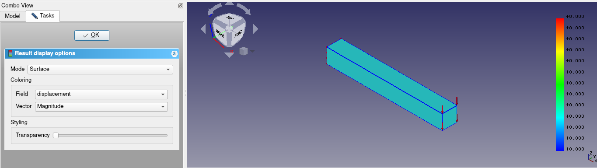
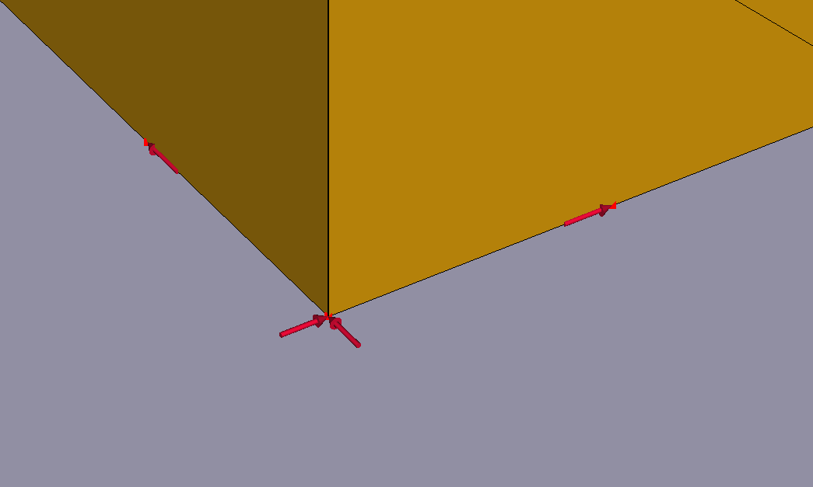
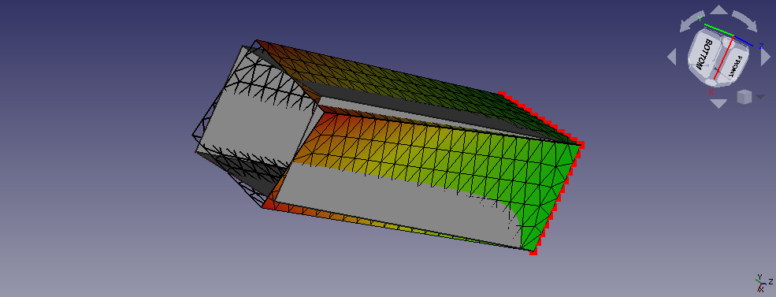

Working more on Elmer this week, we found some issues with examples that
Elmer should be able to solve.

The first one was the `cantilever_nodeload` example. It is similar to
the `faceload` example, except that here the force is appiled on
nodes/vertecies/corners. Now since the examples are similar, the results
should be similar if not exact same. But we found that this was not
happening. In fact, Elmer was giving zero deformations!!

For resolving this, we again opened a [separate
thread](https://forum.freecadweb.org/viewtopic.php?f=18&t=48605) but
this issue hasn't been resolved as of yet.

Secondly, we also tried to correct the `thermomech_bimetal` example
which HoWil tried to solve with Elmer during the [7th week](week7.md).
We created another [new
thread](https://forum.freecadweb.org/viewtopic.php?f=18&t=48625) for
this where it was told by HoWil that we can obtain the correct results
by changing the `Linear Solver Type` from `Iterative` to `Direct`
(again) and by giving the `Heat` equation more priority than the
`Elasticity` equation. Now here `Heat` equation is meant to tell Elmer
how to calculate the temparature distribution in the model and the
`Elasticity` equation will tell Elmer how to calculate the deformations.
Thus, giving more priority to `Heat` means that we are asking Elmer to
calculate the temparature distribution first and the deformations later.
And well that makes sense as the deformation is the result of the
differential heating of the two rods.

Node Loads on Square Pipe
-------------------------

Remember the `edge_load_calculation` example that I made during the [8th
week](wee8.md)? And I said that there is another way to get the twist.
So similar to the difference between the faceload and the nodeload, we
have the edge load and node load. Which means that all the forces that
we applied on the edges of that example, we will apply on the
nodes/points of this example. Also, we will use the same mesh for both
the examples. And if the results of both the examples are really exactly
same, this would indicate that our implementation of mesh tools and line
loads are working perfectly fine.

But making this example wasn't easy. First off because the icons of the
force and fixed constraints become really small when applied on a point.
In fact they change size according to the object on which they are
applied. For points, they almost become point size. This below is a
really, really zoomed in view:

This in fact is a long time standing bug in FreeCAD. I may try to see
why it hasn't been resolved till now. Now the 4 forces (1 per edge) of
the edgeload were divided into 12 forces (3 per edge) in the nodeload.
Also each force in the edgeload was 1,00,000N and for nodeload this was
divided into forces of 66666.67N, 27777.78N, 5555.56N (add them up and
you will get 1,00,000N). This was done cause we need to apply more force
on the inner nodes of the edge then the corner nodes. Remember that our
goal is to replicate the edgeload by applying appropriate loads on the
nodes. So each edge was divided into 13 nodes. On both the corner nodes
a force of 5555.56N was applied. Coming in, we apply 66666.67N and
27777.78N on 6 and 5 nodes respectively and alternatively. The direction
of all these forces is kept parallel to the edge and in such a way that
it creates the twisting effect we want.

But even then, because of the almost invisible icons of forces it was
really difficult to get them all in the correct place and direction. I
couldn't just replicate the file given by Bernd because the names of the
edges were not same. Hence for this example, for the first time during
GSoC, I had to take out a pen and paper and do things manually.

So this was the toughest example till date, mostly because of the tiny
size of force icons but then the results are coming off pretty nicely:

By this time if you are asking what does `xkcd` mean, well here is the
author's answer:

