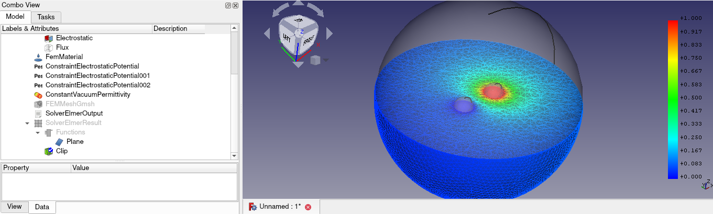
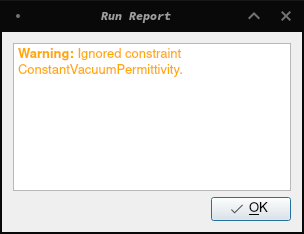
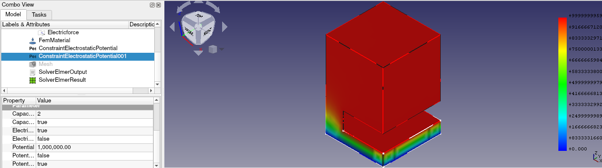

% GSoC Days: Week 12

The week started we me completing the z88 testing framework (which I had implemented in the [10th week](week10.md)) by adding all the required examples.
The results from z88 were exactly same to the one from calculix and so it was merged quickly.

## Debugging the Hinged Beam example

Remember the error in the hinged beam example which we discovered during the [9th week](week9.md)? So there were 2 culprints for the wrong results.
One was that I was making a single transform constraint and giving 2 references, rather than making a different constraint for each reference. And when you think about it, it makes sense that each face would need a separate transform constraint cause the same transformed coordinate won't work for both the different faces.
The other issue was that we had not refined the model when we fused the different sub-parts. It was [found by Bernd](https://forum.freecadweb.org/viewtopic.php?p=418163#p418163). Because of this, each different sub-parts were still an individual identity in the fused model. You can think of it as an incomplete fusion.

So anyway, after resolving these issues I added a [CompoundFilter](https://wiki.freecadweb.org/Part_CompoundFilter) cause according to Bernd it makes for a cleaner model. With this, this example was finally done!

## Capacitance Two Balls Example

Also in the [9th week](week9.md) we started working on this example. We had the example coded but the results were not good.
This was majorly because HoWil was using post processing tools available in FreeCAD-FEM to better visualise the results (yeah the same post processing plane that was crashing my FreeCAD earlier). With some guidance from HoWil, I was able to use the [plane post create functions](https://wiki.freecadweb.org/FEM_PostCreateFunctions) to slice the model in half and see the result of simulation properly. 

Now the reason we were not getting correct results was because the mesh wasn't correctly built. You see, this model has 3 components, the 3 spheres, but the outer sphere completely engulfs the inner shperes. In fact in the complete model, the inner spheres are like internal holes in the outer sphere.
So when I created the mesh normally, I only created it for the outer sphere which is why the results were coming out incorrectly cause for the solver the relevant thing is not the model but the mesh.
To get the inner spheres meshed too, I had to create [mesh regions](https://wiki.freecadweb.org/FEM_MeshRegion) for the inner spheres. After that we started to get some correct results. By the way, in the example, the main result is not a field which you can visualise. But instead it was the capacitance whose value is available in the `ElmerSolverOutput` document object. To finally complete this example, we just created a finer mesh around the inner spheres by decreasing the length of mesh region. But even when we got an acceptable result, we were still getting this warning:

Although it was irrelevant as the results were correct after all.

## Simple Electrostatics Example

Meanwhile, HoWil gave me [another example](https://forum.freecadweb.org/viewtopic.php?f=18&t=41488&start=60#p401652) which would be the simplest example to demonstrate the calculation of capacitance. It's just a cube with two potentials on opposite faces. And since it was so simple, I completed it within a day with very exact results.

## Elmer Electrostatics Example

We also got an [update](https://forum.freecadweb.org/viewtopic.php?f=18&t=41488&hilit=warning&start=100#p416450) on the electrostatics example which we had started in the [6th week](week6.md). So I changed the reference faces for the higher potential. Even then we were not getting correct results for the potential (which can be visualised) and electric force (which is available in `ElmerSolverOutput`). Then HoWil informed me that somehow the calculation of capacitance is interfering with other results. So after switching that off, we finally got the correct results. But... my results were off from HoWil's by 3 zeroes. Turns out he was calulating in ISO units (m/kg/s) while I was calculating in FreeCAD standard units (mm/kg/s) hence the difference of 3 digits. And finally, adding a few mesh regions here and there made the results more accurate.

Finally we changed the name of this example to indicate that it is an example from the Elmer tutorial.
And to understand the importance of a meaning ful name, have a look at this:

