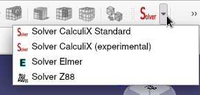

% GSoC Days: Week 13

The week started with more improvements in the example gui. The first one was enabling the double click cause we are all used to opening something by double clicking on it. In our case the double click would be equivalent to clicking "setup".
Then I also added the "wait cursor" using the `setOverrideCursor` of Qt. This is the "waiting" symbol that comes when a process is going on. What used happen before this was that when you would open the example gui or any example, the mouse would just be like a normal arrow cursor giving the impression that FreeCAD has hanged. But after adding this, we properly get the waiting cursor.
Further sorting of the second level of tree in the example gui was done.

## Drop Down menu for Meshers and Solvers

Bernd predicted that he and HoWil may get a little too busy to be very active on this and so he asked if I can help with a side work and obviously I agreed to it.
So on [another thread](https://forum.freecadweb.org/viewtopic.php?f=18&t=48733), there was a discussion going on to change the icons for [Gmsh](https://gmsh.info/) and [Netgen](https://ngsolve.org/) mesher objects.
Currently, both are separate items on the tool bar. As a result of the discussion, it was decided that we should have a global mesher icon of a drop down menu. And both the mesher would be part of the drop down menu. And a similar thing was suggested for the solvers too since they are also separate items right now.
This is where my role came. I had to implement this.

Originally, it was decided to be done in C++ as FEM currently has no drop down menu implementation in python. I tried C++ but the issue was that both the meshers' and solvers' commands are defined in python. So Bernd suggested me to do it in python itself, taking inspiration from drop down implementation in other workbenches. This was quite easy and was quickly done:

But.. but there was an issue. Netgen is implemented differently in FreeCAD. Unlike Gmsh for which the binary path is given, Netgen is linked as a library during compile time itself. And so, if your FreeCAD isn't compiled with Netgen (like my FreeCAD) then Netgen mesher won't be shown in the tool bar or the menu bar. Now since we are talking about the compile time, this check of whether FreeCAD is compiled with Netgen or not is created as a [pre-processor definition](http://www.cplusplus.com/doc/tutorial/preprocessor/) in [CMake](https://cmake.org/).
To say simply, this check of FreeCAD with Netgen is in C++ and can't be accessed in python. And so, I can't condionally stop Netgen from showing up in the toolbar.
Hence, even though this side work was completed, it couldn't be merged just yet.

And what else does C++ have that python doesn't? Yeah, pointers:

