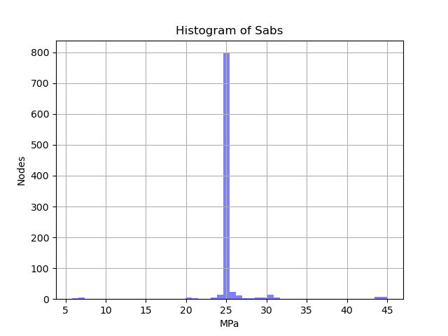
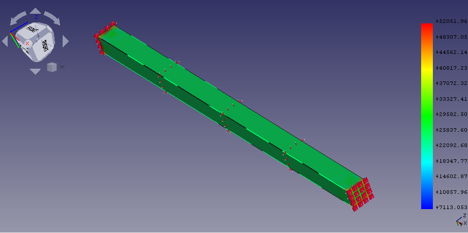
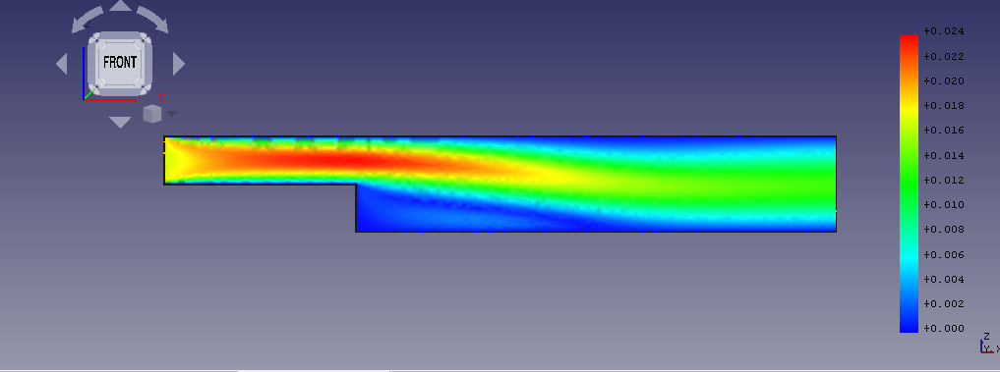
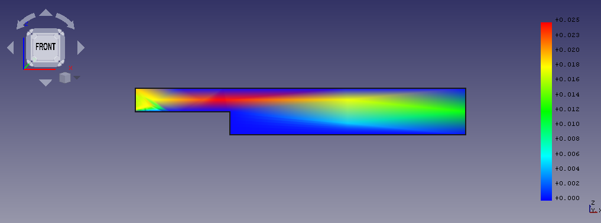

% GSoC Days: Week 14

After passing the second evaluation last week, this week I started work on a new example. This one was a [simscale validation test](https://www.simscale.com/docs/validation-cases/fixed-beam-under-changing-temperature/) example which was made in [FreeCAD by HoWil](https://forum.freecadweb.org/viewtopic.php?f=18&t=22576&start=120#p194595).
This example simulates a fixed beam under changing temperature. The beam is 1m long with a cross section of 0.05 x 0.05 m^2 and the change in temperature is 10K on the outer surfaces. Normally the beam would try to expand but it's fixed on both ends and so this would generate a stress on the fixed ends. We are interested to find this stress developed in the whole beam.
The different thing here was that there was no FreeCAD file available for this example and I had to work only based on the description given. I did made the example but the results were good enough.
For calculix, we can have a look at the histogram generated by it:

So we can see that most of the nodes (elements of the mesh) have a stress of 25 Mpa. This is close to the analytical result of 24.6 Mpa in whole beam. The issue here is that this 25 Mpa is not in all the nodes which is how it should be.
With Elmer, we can see a similar result:

In this result, it is quite clearly visible that the nodes on the fixed faces are showing a higher stress while the nodes in the beam are having stress close to the analytical value. So some improvements are still required but I am not sure what, maybe Bernd or HoWil can tell better.

## Laminar Flow Example

This was another new example on which I started working. It's also a part of the [Elmer GUI tutorials](https://www.nic.funet.fi/pub/sci/physics/elmer/doc/ElmerTutorials.pdf), the tutorial 9 "Navier-Stokes equation – Laminar incompressible flow passing a step" (page 45). This is the first example where we are simulating fluid dynamics. Basically a viscous fluid is passing through a pipe with a sudden step and we are interested and seeing how it's velocity, pressure and temparature changes.
But we do all this in a 2D model so it's like we are observing only a slice of the pipe. For creating the model we used the [Wire from Draft WB](https://wiki.freecadweb.org/Draft_Wire).
After doing all the required things, the first results were quite good and matched nicely with HoWil's file:

But there were two issues! First that the results were not matching those in the Elmer tutorial. Howil said that this was because we had different boundary conditions. Though with his latest work on [free text input](https://forum.freecadweb.org/viewtopic.php?f=18&t=48867&start=10#p420614) we would be able to define custom boundary conditions.

Secondly, the mesh was not getting imported/exported properly. To be more precise, the edges were getting lost during import/export of the mesh as I have explained in [this post](https://forum.freecadweb.org/viewtopic.php?f=18&t=44705&start=500#p422779). This wasn't effecting the results but the visualisation:

When I checked further, the edges were getting lost in all other 2D mesh examples too but maybe we never noticed this because none of them can be solved using Elmer.

But anyway, FreeCAD-Elmer sure makes fluid dynamics rather easy to work with cause it's a rather difficult subject:

