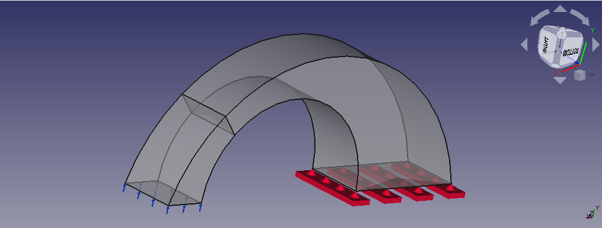

% GSoC Days: Week 7

While we were waiting a reply from HoWil to resolve the issue with the electrostatic example, Bernd gave me another example to work on.
This was regarding a new constraint that was being added in FEM workbench. The constraint is called "section print". And when you apply this constraint on a section in the model, you the results for that section apart from the general FEA results.
For example, this is the example we built for this constraint:

So as you can see, there is a section in this arc like model. So by applying the section print constraint we will get addtional info about that section, in our case forces, moment about the origin, etc etc.
Thus, with this new constraint you can get a deeper insight into the ~~stimulated~~ physics that's at work.

Also, this example was also built with sketcher but it was simpler. So within 2 days I was ready with this example but there was some error with implementation which I left for Bernd to resolve.

## Defining air

So as I said in last post, our definition our air wasn't complete and so Elmer solver wasn't picking it as a material. Guess what was missing? Relative Permittivity!
This is the property that shows how easily can a material be polarised, compared to vaccum. Quite an essesntial electric property of a material. Thus it was required to define this for the problem to be completely defined and be solvable. And surely the example was getting solved and the capacitance result was coming good.

As for testing, I wasn't sure initially cause Elmer was creating a lot of input files unlike the single file created by Calculix. HoWil did tell me that it's the .sif (Solver Input File) that's most important but I decided to wait for Bernd as the test framework for ELmer examples wasn't ready yet.

## Bimetall example in Elmer

Out of his good habit, HoWil remind us of the first GSoC evaluation 10 days before the start of it. The he compiled my branch and gave some good suggestions for the improvement of the ExampleGUI.
Then he tried to make the `thermomech_bimetal` example be solvable using Elmer. In this example, we basically have 2 strips of different metals (Copper and Invar here) and we heat them from one end.
Then we see the displacement caused by their different thermal properties. In his first attempt, HoWil got good results though not exact ones:

## Boxes with Multiple Materials

The first example I got from Bernd's old collection was this multmaterial bending beam one.
The idea is simple. We have 5 boxes, made of 3 materials. We put them in line with the material order being `3 2 1 2 3`, fix the boxes on both ends and apply same force on top of all of them. The result is also simple to visualise. The deformation would be highest in the centre and decrease as we go towards the edges:

Bernd had already done most of coding so it was easy to get this one.

The next example from Bernd's collection I tried was called edge\_load\_calculation and I got error while trying to build it but more on it in the next post.
By this time, Bernd was back from his vacation and so it was time for some rebasing again.

Pretty sure Bernd would have liked another vacation, only if he had a time machine:

