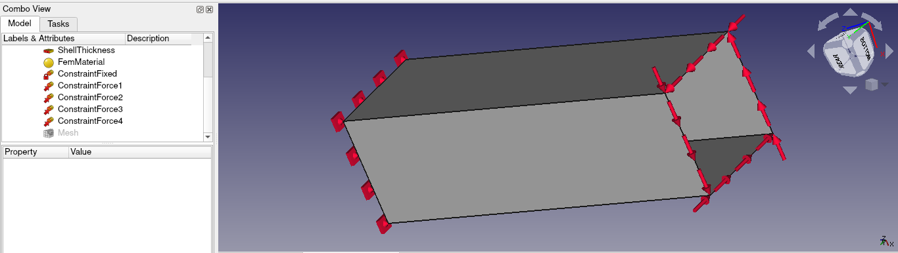
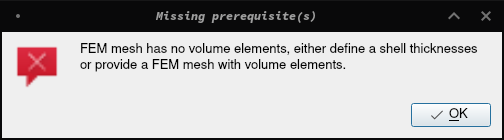

% GSoC Days: Week 8

So the `edge_load_calculation` example that I mentioned in the last post has a 2D geometry, in fact it's a square pipe:

As you can see in the picture, the simple idea is to apply forces on the edges of one side in a rotational manner and to kepp the edges of the other side fixed.
This will obviously give the pipe a twist. There is another for having this example other than analysing the result of the twist, but we will discuss them in later posts.
So as I was saying, this is a 2D model and Calculix told me that loud and clear with this error message:

Now obviously I am not expecting there to be any volume in a 2D model and so no volume elements in the mesh.
As per the error message we need to define a [shell thickness](https://wiki.freecadweb.org/FEM_ElementGeometry2D) and for that Bernd showed me another FEM example which was using the shell thickness.
So I went ahead and defined a shell thickness of 15mm so that now our model is a very thin 3D model.
With this, we were done with this example for now.

## Rewriting History

Bernd was not looking to start getting my work in FreeCAD's master branch, which would make me an official FreeCAD developer.
For that he took my branch and rewrote the history to have only the essential and meaninful commits.
I was quite impressed with that and asked him how he did that. And to my surprise his answer was a git command that I had recently learned; **`git rebase`**
But, the interactive one. You [rewrite history](https://git-scm.com/book/en/v2/Git-Tools-Rewriting-History) using interactive rebase.

After I had rebased my new work on the new clean branch he made, on 23rd July 2020, I became an **Official FreeCAD Developer**.
By the end of this week, I had also got the hang of rewriting my commit history.

## Shells with Multiple Materials

On a similar note to the Boxes with Multiple Materials, Bernd had this Shells with multiple materials example. The only difference between the two is that this one is a 2D model while the previous one was a 3D model.
The results are also similar:

And obviously there is a shell thickness of 10mm for proper meshing.

## Making the Manager Module

After generating a new example, it was needed to register it in the manager module so that it can be solved automatically.
Now by register here, I mean creating a method for that example.
But there was a certain pattern in all the methods:

1. They would import the specific example.
1. Run the `setup()` method to have the example ready.
1. Call the method `run_analysis()` to run the example and get results

Taking inspiration from the recent use of `importlib` that I had done to build the examplegui, I made a single method to replace all the example specific method.
In this method, you would pass the name of the example module and then it will perform the above three steps to get you the results.
With this method in place, now there was no need to register a new example which removed 1 step from the list of steps to perform for creating a FEM example.

By the time this method was merged in master, the first coding period had ended and it was time for the first evaluations!

So since we talked a bit about 2D and 3D, how about a 3D movie:

Didn't get it? How about some [explaination](https://www.explainxkcd.com/wiki/index.php/848:_3D)?
Or just watch this [comic in 3D](https://xk3d.xkcd.com/848/)!
