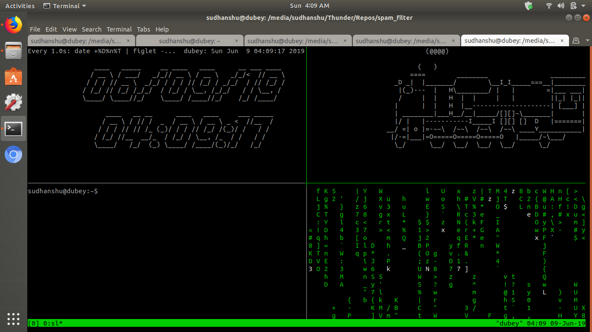

# Day 4 of Summer Internship

*Date: June 7th, 2019*

Today I was busy with other stuff at the office and was not able to do much of my project related work.
Since my colleagues' task is to learn about Linux system administration, we were trying to install Ubuntu in their system.
As a safety measure against possible loss of data, we tried to [transfer data from his Windows to my Linux system](https://hacksd.wordpress.com/2019/06/07/windows-to-linux-file-transfer-over-lan/) but in vain.
Then transfer the data to an HDD, we finally installed Ubuntu in his system (with some difficulties due to partitioning problems).

### Understanding and Commenting

I took my basic code from [this blog](https://appliedmachinelearning.blog/2017/01/23/email-spam-filter-python-scikit-learn/).
I read and understood the whole and provided useful comments wherever I thought was neccessary.

Some of the new python methods about which I got to learn today were:

1. [os.path.join()](https://docs.python.org/3/library/os.path.html?highlight=os%20path%20join#os.path.join)
2. [enumerate()](https://docs.python.org/3/library/functions.html?highlight=enumerate#enumerate)

### Executing the Code

After understanding the code to some extent, I executed it and got the following error:

``UnicodeDecodeError: 'utf-8' codec can't decode byte 0xc4 in position 16: invalid continuation byte``

What it meant was that the training set that I was using contained such mails which python was not able to decode using [UTF-8](https://en.wikipedia.org/wiki/UTF-8).

This could simply imply that the mails were not encoded using UTF-8 in the first place.
But searching with the error message did not resulted in much fruitful solutions so I consulted my head.
According to him, it was completely ok for the emails to be encoded in any format. It is our code that should be flexible enough to deal with all the formats. We need to ensure maximum customer convenience as a software company. And yeah, he had a point.

I also asked him for a local server so that we can work collaboratively on the project, since I am not allowed to put the code on Github.

While waiting for the credentials, I wrote the [blog](https://hacksd.wordpress.com/2019/06/07/windows-to-linux-file-transfer-over-lan/) on our attempt to transfer the data and played around with [watch](https://www.howtoforge.com/linux-watch-command/) and [tmux](https://www.poftut.com/linux-tmux-tutorial-command-examples/) to create something like:

But don't take these commands lightly, they are extremely useful ones.
And so, another day of my training ended

